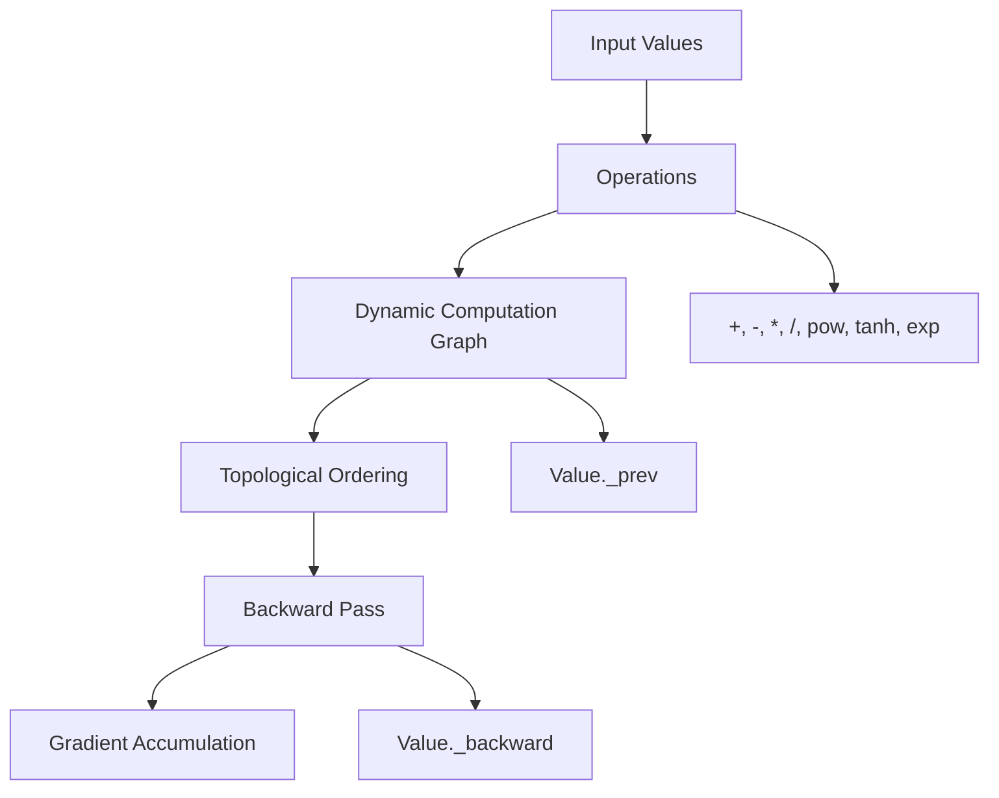

<div align="center">

# Autograd Engine
### Reverse-mode automatic differentiation engine with dynamic computation graphs, gradient validation, and system-level performance analysis.

</div>

---

## Problem

Modern deep learning frameworks abstract away gradient computation and execution behavior. This project rebuilds a minimal autograd engine from first principles to understand how computation graphs are constructed, traversed, and executed, and how system constraints affect performance.

---

## Overview

This project implements a PyTorch-like autograd system with dynamic computation graphs and reverse-mode differentiation. The focus is not only on correctness, but also on analyzing performance, scalability, and execution trade-offs.

---

## Architecture

The engine constructs a dynamic computation graph during the forward pass and performs reverse-mode automatic differentiation using a topological traversal.



---

## Computation Graph Visualization

Example computation graph after forward and backward pass:


---

## System Capabilities

- Reverse-mode automatic differentiation for scalar values
- Dynamic computation graph construction
- Topological sorting for backward pass
- Gradient accumulation across multiple dependency paths
- Neural network components: `Neuron`, `Layer`, and `MLP`
- Gradient validation using numerical finite differences
- Backward-pass benchmarking and scaling analysis

---

## Key Metrics & Observations

| Category | Metric | Result |
|---|---:|---:|
| Correctness | Gradient error | ~1e-10 |
| Performance | Backward time at 400 nodes | 0.00114 s |
| Scaling | Largest benchmarked graph | 10,000 nodes |
| Training | Loss reduction | 0.90 → 0.76 |
| Engineering | Traversal strategy | Recursive → Iterative DFS |

### Observations

- Backward pass time increases approximately linearly with graph size.
- Recursive traversal introduces stack depth limitations for deep computation graphs.
- Iterative DFS improves scalability and supports larger graphs.
- Small scalar graphs can show lower overhead than PyTorch due to minimal abstraction.
- PyTorch comparison results should not be interpreted as general performance superiority.

---

## Benchmark Results

Run:

```bash
PYTHONPATH=. python benchmarks/benchmark_scalar.py
```

Example results:

```text
graph_size=100,   backward_time=0.000323s
graph_size=1000,  backward_time=0.002406s
graph_size=5000,  backward_time=0.010410s
graph_size=10000, backward_time=0.115016s
```


---

## PyTorch Comparison

This benchmark compares backward-pass time for small scalar computation graphs.

Run:

```bash
PYTHONPATH=. python benchmarks/benchmark_compare.py
```

Example results:

```text
graph_size=50,  my_engine=0.000077s, pytorch=0.003949s, ratio=0.02x
graph_size=100, my_engine=0.000180s, pytorch=0.000842s, ratio=0.21x
graph_size=200, my_engine=0.000388s, pytorch=0.002813s, ratio=0.14x
graph_size=400, my_engine=0.000723s, pytorch=0.004878s, ratio=0.15x
```

### Interpretation

For very small scalar graphs, this educational engine can appear faster because PyTorch includes additional framework overhead. These results are useful for understanding graph construction and backward traversal behavior, but they are not meant to claim performance superiority over PyTorch.

---

## System Insights

- Computation graph size directly impacts backward traversal cost.
- Recursive graph traversal does not scale well for deep graphs.
- Iterative traversal avoids recursion depth limitations.
- Gradient accumulation is required when a node contributes to multiple downstream paths.
- Framework overhead matters for small graphs, while generality and optimized kernels matter at scale.

---

## Example Usage

```python
from autograd.engine import Value

a = Value(2.0)
b = Value(3.0)

d = a * b + a
d.backward()

print("a.grad =", a.grad)  # 4.0
print("b.grad =", b.grad)  # 2.0
```

---

## Training a Neural Network

Run:

```bash
PYTHONPATH=. python examples/train_mlp.py
```

Example output:

```text
epoch 0,  loss = 0.90
epoch 5,  loss = 0.83
epoch 10, loss = 0.81
epoch 19, loss = 0.76
```

---

## Gradient Checking

This project validates autograd gradients against numerical finite-difference gradients.

Run:

```bash
PYTHONPATH=. python scripts/grad_check.py
```

Example output:

```text
numerical_grad = 7.000000000090267
autograd_grad  = 7.0
error          = 9.026734915096313e-11
```

---

## Engineering Evolution

- Started with recursive graph traversal.
- Identified recursion depth limitations in deep computation graphs.
- Replaced recursive traversal with iterative DFS using an explicit stack.
- Improved scalability from recursion-limited graphs to 10,000+ node benchmarks.
- Re-benchmarked the system after the traversal change.

---

## Project Structure

```text
autograd/
  ├── engine.py
  └── nn.py

tests/
examples/
benchmarks/
results/
```

---

## Testing

Run:

```bash
PYTHONPATH=. pytest -q
```

Output:

```text
7 passed
```

---

## Tech Stack

- Python
- PyTest
- Matplotlib
- Graphviz

---

<div align="center">

*Omprakash Sahani — Machine Learning Systems Engineer*

</div>
