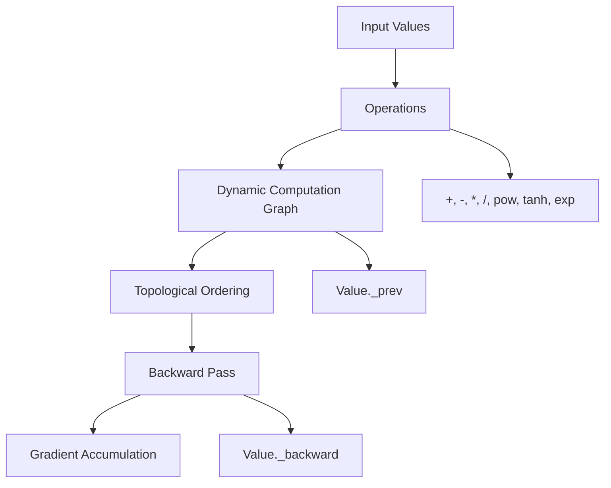
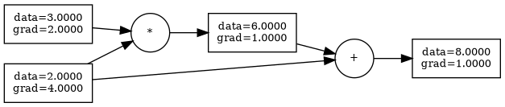
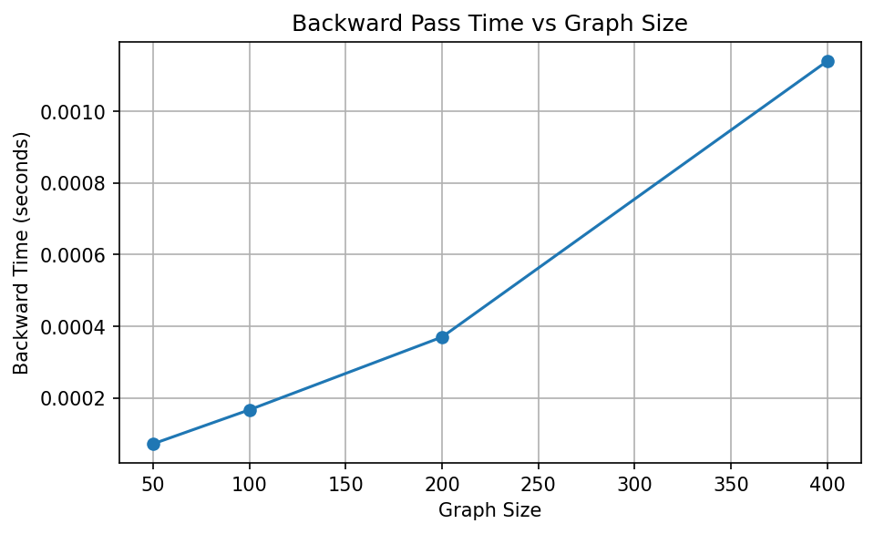

# Autograd Engine
git add README.md
A reverse-mode automatic differentiation engine built from scratch, designed to explore the core mechanics of backpropagation, computation graphs, and neural network training.

---

## Overview

This project implements a minimal PyTorch-like autograd system with:

* Dynamic computation graph construction
* Reverse-mode automatic differentiation
* Custom neural network modules (MLP)
* Unit testing for correctness
* Performance benchmarking of backward pass

The goal is to understand how modern ML frameworks handle gradients at a systems level.

---

## Architecture

The autograd engine builds a dynamic computation graph during the forward pass and performs reverse-mode automatic differentiation using a topological traversal of the graph.


---

## Computation Graph Visualization

Example computation graph for a simple expression after forward and backward pass:



---

## Features

* Scalar reverse-mode autodiff
* Backpropagation from first principles
* Support for operations:

  * Addition, subtraction, multiplication, division
  * Power
  * `tanh`, `exp`
* Neural network components:

  * Neuron
  * Layer
  * Multi-Layer Perceptron (MLP)
* Unit tests (7 passing)
* Benchmarking of backward pass performance

---

## Key Metrics

| Category        | Metric                          | Value |
|----------------|---------------------------------|------:|
| Correctness    | Gradient error                  | ~1e-10 |
| Performance    | Backward time (400 nodes)       | 0.00114 s |
| Scaling        | Graph size vs time              | Linear growth |
| Training       | Loss (epoch 0 → 19)             | 0.90 → 0.76 |
| Comparison     | Speed vs PyTorch (small graphs) | up to ~0.02x |
| Scalability | Largest benchmarked graph size | 10,000 |
| Engineering | Graph traversal | Recursive → iterative DFS |

---

## Example Usage

```python
from autograd.engine import Value

a = Value(2.0)
b = Value(3.0)

d = a * b + a
d.backward()

print("a.grad =", a.grad)  # 4.0
print("b.grad =", b.grad)  # 2.0
```

---

## Training a Neural Network

```bash
PYTHONPATH=. python examples/train_mlp.py
```

Example output:

```
epoch 0, loss = 0.90
epoch 5, loss = 0.83
epoch 10, loss = 0.81
epoch 19, loss = 0.76
```

---

## Gradient Checking

This project validates autograd gradients against numerical finite-difference gradients.

```bash
PYTHONPATH=. python scripts/grad_check.py
```

Output:

```
numerical_grad = 7.000000000090267
autograd_grad  = 7.0
error          = 9.026734915096313e-11
```

## Benchmark

Run:

```bash
PYTHONPATH=. python benchmarks/benchmark_scalar.py
```

Results:

```
graph_size=100, backward_time=0.000323s
graph_size=1000, backward_time=0.002406s
graph_size=5000, backward_time=0.010410s
graph_size=10000, backward_time=0.115016s
```

### Benchmark Graph



### Scaling Behavior

- Backward pass time increases approximately linearly with graph size  
- Iterative traversal removes recursion depth limitations  
- Successfully scaled from ~400 nodes (recursive limit) to 10,000 nodes  

---

## PyTorch Comparison

This benchmark compares backward-pass time for small scalar computation graphs.

```bash
PYTHONPATH=. python benchmarks/benchmark_compare.py
```

```
graph_size=50,  my_engine=0.000077s, pytorch=0.003949s, ratio=0.02x
graph_size=100, my_engine=0.000180s, pytorch=0.000842s, ratio=0.21x
graph_size=200, my_engine=0.000388s, pytorch=0.002813s, ratio=0.14x
graph_size=400, my_engine=0.000723s, pytorch=0.004878s, ratio=0.15x
```

## Interpretation

For very small scalar graphs, this educational engine can appear faster because PyTorch includes additional framework overhead. These results should not be interpreted as general performance superiority over PyTorch. The purpose of this benchmark is to compare graph construction and backward traversal behavior on small scalar workloads.

---

### Observations

* Backward pass time increases with computation graph size
* Recursive graph traversal introduces a recursion depth limitation
* Larger graphs require iterative traversal for scalability

---

## Project Structure

```
autograd/            # core autograd engine
  ├── engine.py
  ├── nn.py
tests/               # unit tests
examples/            # usage examples
benchmarks/          # performance benchmarks
results/             # benchmark outputs
```

---

## Testing

```bash
PYTHONPATH=. pytest -q
```

Output:

```
7 passed
```

---

## Engineering Notes

* Implements topological sorting for backpropagation
* Uses dynamic graph construction (define-by-run)
* Gradients are accumulated during backward pass
* Identified recursion limits in deep computation graphs

---

## Future Work

- Identified recursion depth limitation in deep computation graphs  
- Replaced recursive traversal with iterative DFS using an explicit stack  
- Improved scalability from ~1k nodes to 10k+ nodes  
- Re-benchmarked system after architectural change  

---

## Tech Stack

* Python
* PyTest

---

## Author

Omprakash Sahani
Machine Learning Systems Engineer (Early Career)
